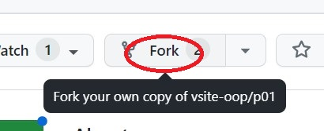
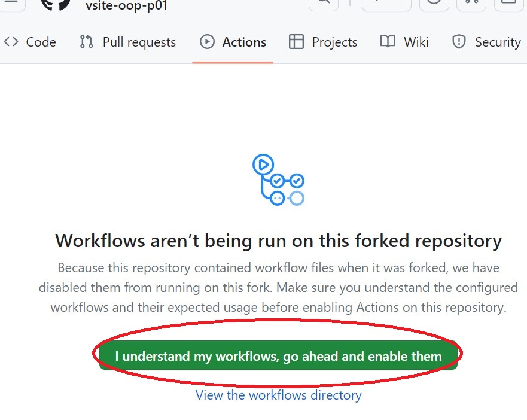
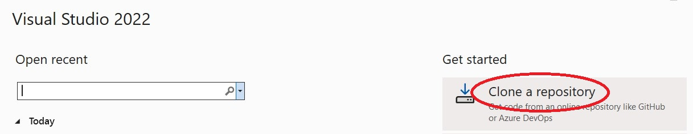
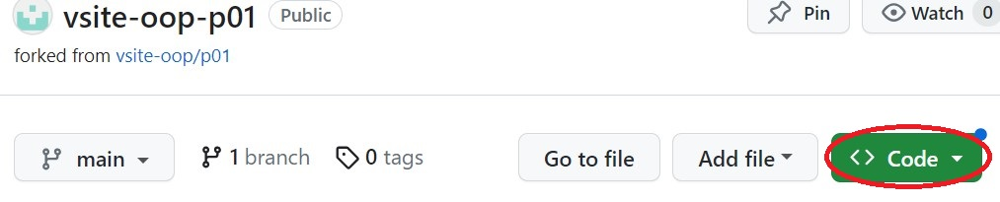
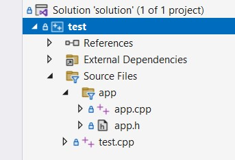
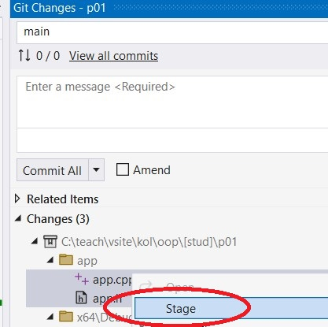
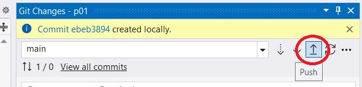
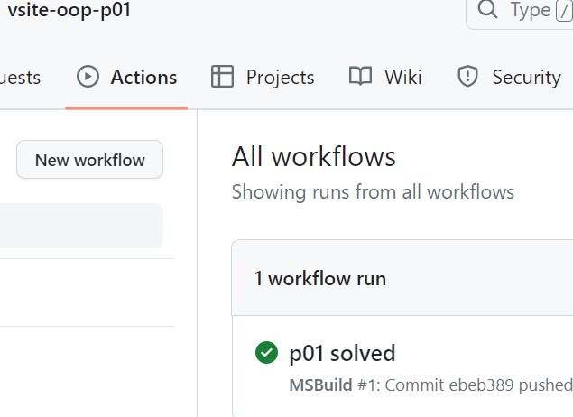

# VSITE OOP predavanje 1

Implementirajte sve funkcije potrebne da svi testovi prolaze.

### Uputstva za rješavanje / slanje rješenja:

1. Napravite *fork* repozitorija

<kbd></kbd>

Unesite ime repozitorija (nešto kao vsite-oop-p01) ili ostavite p01. Kliknite "Create Fork"

2. Na Actions, odaberite "I understand my workflows, go ahead and enable them"

<kbd></kbd>

3. Napravite *clone* repozitorija. 

<kbd></kbd>

Koristeći VS 2022:
- "Repository Location" dobijete klikom na Code, nešto poput "https://github.com/[stud]/vsite-oop-p01.git"
- "Path" je folder na PC-u, nešto poput C:\vsite\kol\oop\[stud]\p01

<kbd></kbd>

4. U VS otvorite Test Explorer (menu Test / "Test Explorer")

5. Pokrenite build solutiona (menu Build / "Build Solution")

<kbd></kbd>

6. Build nije prošao. Testovi u `test.cpp` se ne kompajliraju 
jer ne postoje funkcije koje testovi pozivaju.
Upravo ste u "red" stanju TDD-a. 

7. U `app.h` dodajte deklaracije traženih funkcija (`f1` do `f6`). 
Sad kad pokrenete build, kompajliranje prođe, ali linker prijavljuje greške 
jer nije našao kod funkcija.

8. U `app.cpp` dodajte implementaciju funkcija (`f1` fo `f6`). 
Sad kad pokrenete build, build će proći i Test Explorer će pokazati pronađene testove.

<kbd></kbd>

9. Pokrenite testove. Ako su implementacije funkcija točne svi će testovi biti zeleni.
Sad ste u "green" fazi TDD-a. 
Napravite popravke i promjene na kodu ako treba ("refactor" faza TDD-a). 
Pokrećite testove nakon svake promjene.

<kbd></kbd>

10. Dodajte u git commit samo one fileove koje ste promijenili ("Stage" na `app.h` i `app.cpp`)

<kbd></kbd>

11. Napišite komentar i napravite commit.

<kbd></kbd>

12. Napravite push commit-a u Github repozitorij.

<kbd></kbd>

13. Na Actions tabu na Githubu (https://github.com/[stud]/vsite-oop-p01/actions) 
bi se morao pojaviti "workflow run" i nakon nekog vremena zazeleniti.

<kbd></kbd>

14. Ako je sve zeleno, napravite *pull request* (u VS: menu Git / Github / New Pull Request). 

<kbd></kbd>

Ako je sve prošlo OK, vidjet ćete svoj PR na popisu https://github.com/vsite-oop/p01/pulls.
